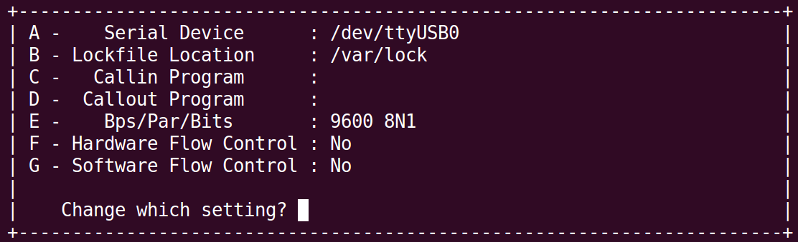

# Prequest
### Ubuntu 14.04
Please use [Ubuntu 14.04](http://releases.ubuntu.com/14.04/).

### ROS Indigo
Please follow this [link](http://wiki.ros.org/indigo/Installation/Ubuntu) to install ROS Indigo.

### ROS Control
```
sudo apt-get install ros-indigo-ros-control ros-indigo-ros-controllers
```

### Serial Library
```
cd /tmp
git clone https://github.com/willie5588912/libserial-0.6.0rc2.git
cd libserial-0.6.0rc2
./configure
make
sudo make install
sudo ldconfig
```
# Install
### Clone the repository
```
roscd; cd ../src
git clone https://github.com/willie5588912/rsc_car_course.git
cd ..
catkin_make
```
### Add group
```
sudo usermod -a -G dialout <username>
```
You should log out and then log in again.

# Usage
### Real car
```
roslaunch rsc_car_ros_control rsc_car_ros_control.launch
```

* Subscribe topic: /rsc_car_diff_drive_controller/cmd_vel
* Publish topic: /rsc_car_diff_drive_controller/odom

So you can publish cmd_vel to control the car. For example, you can use rqt_robot_steering, and use the topic name:**/rsc_car_diff_drive_controller/cmd_vel**
```
rosrun rqt_robot_steering rqt_robot_steering _default_topic:=/rsc_car_diff_drive_controller/cmd_vel
```

### Simulation (optional)
```
roslaunch rsc_car_description rsc_car_gazebo.launch
```

# Trouble Shooting
### Wrong direction / Don't move
Please use Faulhaber motion manager to check the node number of the controllers. The right wheel should be node 1 and the left wheel should be node 2. Also, make sure the battery voltage should not be lower than 12V.

### Tool for sanity check: Minicom
```
sudo apt-get install mincom
```
Set up the protocol parameters (do this only at the first time):
```
sudo minicom -s
(If you have set up the parameters, just type "minicom" in terminal. The minicom will be launched.)
```
1. Choose "**Serial port setup**", and the settings should be as following:

2. Press Enter and then choose "**Save setup as dfl**"
3. Choose "**Exit**", and the you will be in minicom.
4. Press "**Ctrl + a**". Next, release and press "**z**",  and then press "**e**" to enable echo on the screen.
5. You can send commands now.
```
en (Enable motors. The motors should output torque.)
1v100 (The motor of node 1 will move in 100rpm.)
v0 (Stop all the motors)
```


